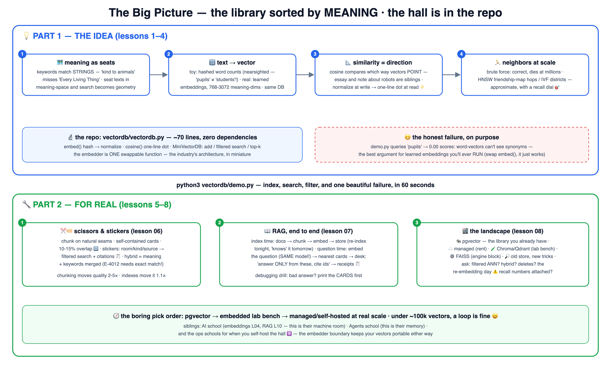

# 🗺️ Learn Vector Databases the School Way — with a runnable mini DB

The library sorted by **meaning** — the machine under semantic search, RAG and agent
memory. Taught the school way: **a real mini vector database in the repo**, ~70 lines
of pure Python, zero dependencies — including one honest, deliberate failure that
explains why learned embeddings exist.

🌐 **Interactive site:** **<https://baluraut.github.io/learn-vectordb-school/>** —
lesson cards, numbered diagrams, the big-picture 4K, and
**[the product landscape](https://baluraut.github.io/learn-vectordb-school/landscape.html)**
(pgvector · Pinecone-class · Chroma/Qdrant · FAISS · old-store-new-tricks, compared honestly).

Siblings: [AI](https://github.com/BaluRaut/learn-ai-school) (embeddings L04, RAG L10) ·
[Agents](https://github.com/BaluRaut/learn-agents-school) (this is their memory layer) ·
[MCP](https://github.com/BaluRaut/learn-mcp-school) · plus the ops schools
([Kubernetes](https://github.com/BaluRaut/learn-kubernetes-school),
[Docker](https://github.com/BaluRaut/learn-docker-school),
[AWS](https://github.com/BaluRaut/learn-aws-school),
[ArgoCD](https://github.com/BaluRaut/learn-argocd-school)).

## 🚀 The 60-second wow

```bash
python3 vectordb/demo.py
```

Seven school documents indexed → a ranked semantic-ish search → a metadata-filtered
lookup → and an honest **0.00 failure on the synonym "pupils"** — the best argument
for learned embeddings you'll ever run.

## 🗺️ The big picture



## 🎓 The 8 lessons

Branches are **sequential** — branch 05 contains lessons 01–05.

| # | Branch | You learn | Analogy |
|---|---|---|---|
| 01 | `lesson-01-why-vector-db` | Why keyword search isn't enough | The library sorted by meaning 🗺️ |
| 02 | `lesson-02-text-to-vectors` | Toy vectors vs learned embeddings | Giving every text a seat 🔢 |
| 03 | `lesson-03-similarity` | Cosine, dot, distance — and the normalize trick | Direction beats distance 🧭 |
| 04 | `lesson-04-nearest-neighbors` | kNN, the wall, HNSW/IVF, recall | The friendship map 🏃 |
| 05 | `lesson-05-build-a-vector-db` | Read vectordb.py whole + extend it | 70 honest lines 🔬 |
| 06 | `lesson-06-chunking-metadata` | Chunking, overlap, filters, hybrid | Cards and colored stickers ✂️🏷️ |
| 07 | `lesson-07-rag-wiring` | RAG end to end with OUR page-finder | The open-book exam 📖 |
| 08 | `lesson-08-landscape` | pgvector → Pinecone: picking for real | The product map 🏬 |

## 📦 What's in this repo (main branch)

```
learn-vectordb-school/
├── vectordb/
│   ├── vectordb.py   # the REAL mini vector DB: embed, cosine, store, filter, top-k
│   └── demo.py       # 7 chunks · 3 searches · 1 honest failure
└── docs/             # the GitHub Pages site (incl. the landscape page)
```
