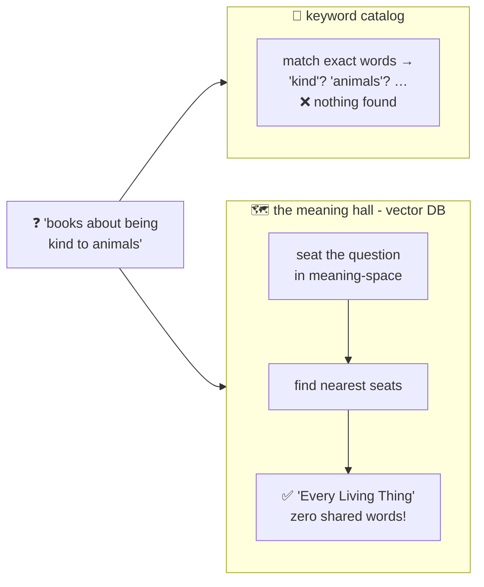

# 🗺️ Lesson 01 — Why vector databases: the library sorted by meaning

**📍 You are here:** Lesson **01** of 8 · Next: `lesson-02-text-to-vectors`

---

## 📦 What's in this branch

The problem vector databases exist to solve — and a real mini one you
can run right now: [vectordb/vectordb.py](../../vectordb/vectordb.py).

## 🧒 Explain like I'm 5

The school library has a search problem. 📚 The card catalog finds books
by **exact title words**. Ask for *"books about being kind to animals"*
and the catalog finds… nothing — because the best book is called *"Every
Living Thing"*. Not one shared word! The librarian who's read everything
KNOWS it's the right book. The catalog can't know: **keywords match
strings, not meaning.**

Now remember the AI school's seating hall (its lesson 04): every text can
get a **seat in meaning-space** — coordinates where similar meanings sit
close together. Suddenly search becomes geometry: *seat the question,
look around, hand back the nearest neighbors.* "Kind to animals" sits
right next to "Every Living Thing", zero shared words needed.

A **vector database** is the hall built for real: a place to **store
millions of seats** (vectors) and **find the nearest ones fast**. That's
the whole product:

1. put things in, each with its seat (and a few stickers 🏷️ — metadata),
2. given a new seat, return the k closest, quickly,
3. at any scale, without asking every seat one by one.

Everything else — chunking, filters, indexes, RAG — is refinement of
those three jobs, and this course covers each.

## 🗺️ Diagram



## ❓ What

- **Vector database** = storage + fast nearest-neighbor search over
  embedding vectors, usually with metadata filtering. Examples you'll
  meet in lesson 08: pgvector, Pinecone, Chroma, FAISS-based systems.
- It's the plumbing under: semantic search, RAG (AI school L10 — the
  open-book exam's page-finder!), recommendations, dedup ("have we seen
  a ticket like this?"), and agent memory (Agents school L04).
- Keyword search isn't dead — it's *precise* where vectors are *fuzzy*
  (exact IDs, names, error codes). Grown-up systems use BOTH (hybrid —
  lesson 06).

## 🤔 Why

Every "chat with your docs" product, every support bot that finds the
right policy, every "similar issues" sidebar — there's a vector DB
underneath. It's the most-deployed piece of AI infrastructure after the
models themselves, and unlike the models, you can understand one
COMPLETELY — ours is ~70 lines.

## 🧪 Try it (60 seconds)

```bash
python3 vectordb/demo.py
```

Seven school documents indexed, three searches: a ranked semantic-ish
hit, a metadata-filtered lookup, and — most instructive — an honest
FAILURE on the synonym *"pupils"*. That failure is lesson 02's opening
argument. 😄

## ⏭️ Next

How text becomes a seat: **from words to vectors** — and why our toy's
vectors are honest but nearsighted.

```bash
git checkout lesson-02-text-to-vectors
```
