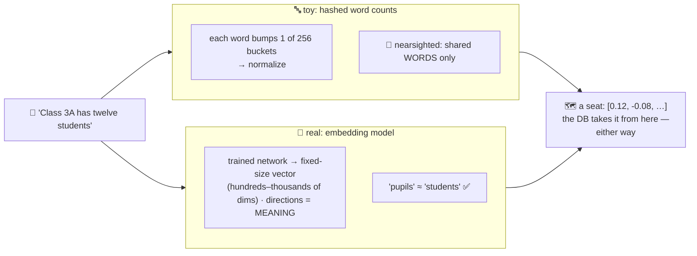

# 🔢 Lesson 02 — Text to vectors: giving every text a seat

**📍 You are here:** Lesson **02** of 8 · Previous: `lesson-01-why-vector-db` · Next: `lesson-03-similarity`

---

## 📦 What's in this branch

Lesson 01, **plus** the entry ritual: how text becomes coordinates —
our toy's way, the real way, and the gap between them (which you
already watched fail on purpose).

## 🧒 Explain like I'm 5

To sit in the hall you need **coordinates**. Two ways to assign them:

**Our toy's way — count the words** 🔤
([vectordb.py](../../vectordb/vectordb.py) `embed()`): the hall has 256
directions; every word (hashed) bumps one of them; normalize so long
documents don't shout. Fast, zero magic — and **nearsighted**: two texts
sit close only if they share literal words. *"pupils"* and *"students"*
sit in different galaxies (the demo's 0.00!). This family — bag-of-words,
TF-IDF, BM25 — powered search for decades and still powers the keyword
half of hybrid search.

**The real way — ask a model that has read everything** 🧠 (AI school
L02+L04): an **embedding model** — a trained neural network — maps text
to a fixed-length vector (hundreds to thousands of coordinates, depending
on the model) where the directions mean *meaning*: learned
from billions of examples, so "pupils" sits beside "students", "refund my
order" beside "I want my money back", across phrasing and even languages.

The beautiful design fact: **the database doesn't care which way you
chose.** Vectors in, neighbors out. Our `embed()` is one function —
swap in a model call and every other line of the course still runs.
(That separation — embedder vs store — is the industry's architecture
too.)

## 🗺️ Diagram



## ❓ What

- **Dimensions**: each coordinate is a direction of variation. Toy: a
  hash bucket (meaningless but consistent). Learned: directions the
  model found useful for predicting text (formality, topic, tone… —
  never labeled, just emergent).
- **Normalization** (`_normalize`): scale every vector to length 1 so
  similarity compares *direction*, not document length — sets up
  lesson 03's clean cosine trick.
- **Same model rule** ⚠️: query vectors and document vectors must come
  from the SAME embedder — seats from different halls don't compare.
  Corollary: change your embedding model → **re-embed everything**
  (lesson 08's operational gotcha).
- Embeddings aren't just for text: images, audio, code, products —
  anything can get a seat (AI school L12's multimodal story).

## 🤔 Why

Choosing an embedder IS choosing what "similar" means for your product —
retrieval quality ceilings live here, not in the database. And knowing
the toy/real gap protects you from both errors: expecting word-vectors
to understand synonyms, and paying model-embedding costs when exact
keyword match was all the job needed.

## 🧪 Try it

```bash
python3 vectordb/demo.py     # re-read the 😬 section knowing WHY now
python3 -c "
import sys; sys.path.insert(0,'vectordb')
from vectordb import embed, cosine
print('students vs student :', round(cosine(embed('students'), embed('student')),2))
print('students vs pupils   :', round(cosine(embed('students'), embed('pupils')),2))
"
# even the plural is a different word to a hash! (real embedders handle both)
```

## ⏭️ Next

Two seats — how close are they, exactly? **Similarity math**: cosine,
dot, distance, and which to use when.

```bash
git checkout lesson-03-similarity
```
