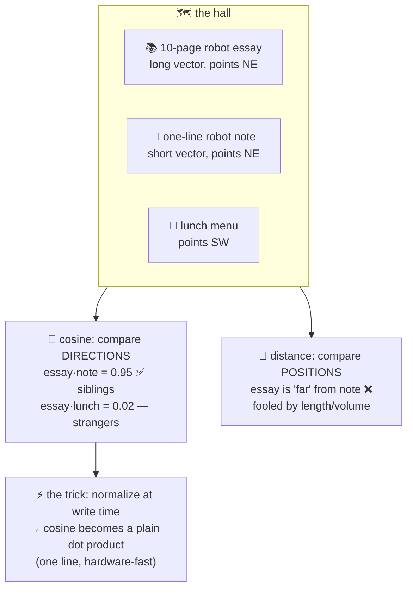

# 📐 Lesson 03 — Similarity: measuring "how close" two meanings sit

**📍 You are here:** Lesson **03** of 8 · Previous: `lesson-02-text-to-vectors` · Next: `lesson-04-nearest-neighbors`

---

## 📦 What's in this branch

Lessons 01–02, **plus** the three-line heart of every vector database:
the similarity function — and why ours is one line of dot product.

## 🧒 Explain like I'm 5

Two kids stand in the hall. How "similar" are they? Two honest measures:

- **How far apart they stand** 📏 (**Euclidean distance**): walk from
  one to the other, count the steps. Smaller = more similar.
- **Which direction they face** 🧭 (**cosine similarity**): ignore where
  they stand — compare the *angle* between the directions they point.
  Same direction = 1.0, right angles = 0.0 (nothing in common),
  opposite = −1.0.

For text, **direction wins**: a 10-page essay about robots and a
one-line note about robots point the SAME way — the essay just points
*harder* (longer vector). Distance would call them different (the essay
stands far away); cosine calls them siblings. Meaning is a direction;
length is just volume. 📢

And the professional trick our toy uses
([vectordb.py](../../vectordb/vectordb.py)): **normalize every vector to
length 1 at write time** (lesson 02) — then cosine collapses into a
plain **dot product**: multiply matching coordinates, add up. One line,
massively fast, hardware-friendly. That's why `cosine()` in our code is
just `sum(x*y …)` — the clever part already happened at the door.

## 🗺️ Diagram



## ❓ What

- **Cosine similarity** = dot(a,b) / (|a|·|b|) — angle between vectors.
  Range −1…1; for normalized vectors it IS dot(a,b).
- **Dot product** raw (unnormalized) mixes direction AND length —
  some recommendation systems want that ("popularity counts").
- **Euclidean (L2)** — actual distance; for normalized vectors it's a
  monotone twin of cosine (same ranking!), so the "which metric" panic
  mostly dissolves once you normalize.
- Practical rule: **text search → cosine on normalized vectors** —
  and match whatever metric your embedding model was trained for (model
  cards say; real DBs let you pick per-collection).
- Scores are *relative*, not absolute truths: 0.8 isn't "80% right" —
  thresholds must be tuned on YOUR data (lesson 07's eval note).

## 🤔 Why

Every search result ordering, every "similar tickets" ranking, every
RAG retrieval — sorted by this one number. When retrieval feels wrong,
step one is always: what metric, was everything normalized, same
embedder both sides? (Three questions, ninety percent of bugs.)

## 🧪 Try it

```bash
python3 -c "
import sys; sys.path.insert(0,'vectordb')
from vectordb import embed, cosine
essay = 'the robot reads books about robots and robot learning ' * 10
note  = 'a robot book'
lunch = 'dal and rice for lunch on tuesday'
print('essay vs note :', round(cosine(embed(essay), embed(note)), 2), '← same direction, wildly different lengths')
print('essay vs lunch:', round(cosine(embed(essay), embed(lunch)), 2))
"
```

Length ×10 — similarity unmoved. Direction is meaning; normalization
already ate the volume. 🧭

## ⏭️ Next

One query vs a MILLION seats — asking everyone is too slow. **Nearest
neighbors**: brute force, the scaling wall, and the shortcut maps (ANN).

```bash
git checkout lesson-04-nearest-neighbors
```
