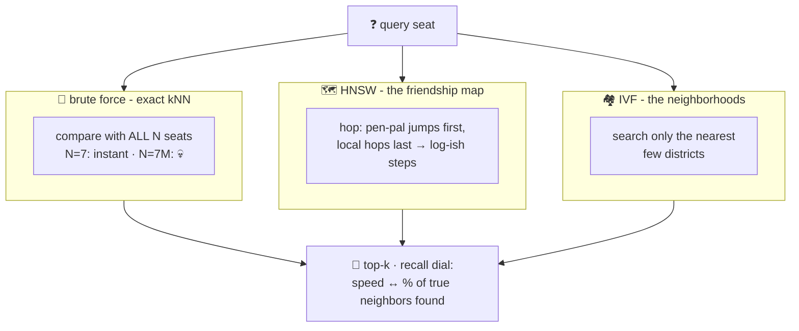

# 🏃 Lesson 04 — Nearest neighbors: asking everyone vs the shortcut map

**📍 You are here:** Lesson **04** of 8 · Previous: `lesson-03-similarity` · Next: `lesson-05-build-a-vector-db`

---

## 📦 What's in this branch

Lessons 01–03, **plus** the scaling story: exact kNN, the wall it hits,
and the **ANN indexes** (HNSW, IVF) that make million-seat halls
searchable in milliseconds.

## 🧒 Explain like I'm 5

*"Find the 5 kids most similar to me."*

**The honest way** 🚶 (brute-force kNN, what our toy does): walk up to
EVERY kid in the hall, compare, keep the best 5. Perfectly correct —
and perfectly linear: 7 kids, instant; 7 million kids × 1,000
coordinates each… your query dies of old age. That's **the wall**.

**The shortcut map** 🗺️ (**ANN** — *approximate* nearest neighbors):
the hall secretly organizes itself:

- **HNSW** — the friendship map 👋: every kid knows a few neighbors,
  plus some kids have long-distance pen-pals across the hall. To find
  your crowd: start anywhere, greedily hop toward more-similar kids —
  express hops first (pen-pals), local hops last. Log-ish hops instead
  of millions of handshakes. (The classic "six degrees" small-world
  trick, engineered.)
- **IVF** — the neighborhoods 🏘️: pre-cluster the hall into districts;
  seat the query, search only the few nearest districts. Simple,
  memory-friendly; can miss a friend standing just across a border
  (probe more districts to fix).

The price of speed: **approximate**. The map might miss a true
neighbor — measured as **recall** ("of the true top-10, how many did we
return?"). Real systems tune a dial: more effort ↔ higher recall.
ANN trades some recall for much faster search — tune the speed ↔ recall
dial on your own data — and for RAG, a page-finder that is right nearly
every time is indistinguishable from perfect.

## 🗺️ Diagram



## ❓ What

- **Vector database ≠ vector index.** A vector *database* is the
  storage-and-query system — seats, stickers, filter, top-k (lesson 05
  builds one). HNSW or IVF is an *indexing/search strategy inside* that
  system. A database can swap its index; an index alone is not a database.

- **kNN** (exact) vs **ANN** (approximate): correctness vs scale. Under
  ~100k vectors, brute force on modern hardware is often FINE — don't
  buy a map for a classroom. 😄
- **HNSW** (Hierarchical Navigable Small World): layered graph;
  parameters `M` (friends per kid) and `ef` (search effort — the recall
  dial). The default engine in most modern vector DBs.
- **IVF** (inverted file): k-means districts; `nprobe` = how many
  districts to check. Often paired with **compression (PQ)** — seats
  stored as rough sketches to fit RAM; rerank the finalists exactly.
- **Recall@k** = the honesty metric every ANN benchmark reports.
  Speed numbers without recall numbers are marketing.
- Our toy stays brute-force ON PURPOSE — 70 readable lines beat a
  graph you can't inspect. Lesson 08 tells you which products carry
  which index so you never build one yourself.

## 🤔 Why

This lesson is the entire *"why is this a database and not a for-loop"*
answer — the for-loop IS correct, it just doesn't scale, and the index
structures are the product. It's also your BS-detector for vendor
benchmarks: ask "at what recall?" and watch the room get honest.

## 🧪 Try it — feel the wall

```bash
python3 - <<'EOF'
import sys, time, random; sys.path.insert(0,'vectordb')
from vectordb import MiniVectorDB
words = ['robot','student','pizza','library','class','lunch','book','teacher']
db = MiniVectorDB()
for i in range(20000):
    db.add(f"d{i}", " ".join(random.choices(words, k=6)))
t = time.time()
db.search("robot library book", k=5)
print(f"brute-force over {len(db):,} chunks: {(time.time()-t)*1000:.0f} ms")
print("now imagine 7 million × 1536 dims — THAT'S why HNSW exists 🗺️")
EOF
```

## ⏭️ Next

Open the machine: **vectordb.py, every line** — and your first
extension to it.

```bash
git checkout lesson-05-build-a-vector-db
```
