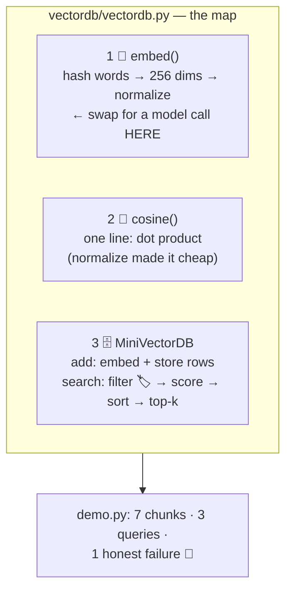

# 🔬 Lesson 05 — Build a vector DB: 70 honest lines

**📍 You are here:** Lesson **05** of 8 · Previous: `lesson-04-nearest-neighbors` · Next: `lesson-06-chunking-metadata`

---

## 📦 What's in this branch

Lessons 01–04, **plus** the guided read of
[vectordb/vectordb.py](../../vectordb/vectordb.py) — the whole course so
far, findable at a line number — and your first extensions.

## 🧒 Explain like I'm 5

Open the file. Three numbered parts, matching the lessons:

1. **TEXT → VECTOR** 🔢 (lesson 02): `_tokens` (lowercase words),
   `embed` (hash each word into one of 256 buckets, bump it,
   normalize). The honest label sits right in the docstring: *replace
   THIS function with an embedding-model call and everything else stays.*
   That one-function boundary is the industry's architecture in
   miniature: **embedder and store are separate jobs.**
2. **SIMILARITY** 📐 (lesson 03): `cosine` — one line of dot product,
   because normalization already happened at the door (`_normalize`).
3. **THE DATABASE** 🗄️ (lessons 04+06): class `MiniVectorDB` — `rows`
   (id, vector, text, metadata), `add()` embeds-and-stores, `search()`
   is brute-force kNN with a **metadata filter** (`all(meta.get(k)==v)`
   — the colored-stickers line, lesson 06 explains why filtering
   BEFORE ranking matters).

Notice what a real product adds — and that none of it changes the
concepts: persistence (ours forgets on exit!), updates/deletes, an ANN
index (L04), concurrency, replication (the k8s school waves hello 👋).

## 🗺️ Diagram



## ❓ What (details worth stealing)

- **What you built is the database, not an index.** MiniVectorDB is the
  storage/query system: it embeds, stores, filters and ranks. Its search
  scans every seat (brute force); swapping that loop for HNSW or IVF
  (lesson 04) would add an *index inside the same database* — the API
  would not change.

- **Normalize at write time, dot at read time** — the single best
  perf trick in vector search, and it's two lines here.
- **Filter before scoring** — `search()` applies stickers first, then
  ranks the survivors. At toy scale it's just correct; at ANN scale
  "filtered search" is a genuinely hard feature (lesson 08 products
  brag about it for a reason).
- **Store the text WITH the vector** — retrieval must hand back
  something a human/model can read; vectors alone are seats without
  kids.
- The `(score, id, text, meta)` tuple sort: highest first — mind
  tuple-ordering traps if scores tie (ids break the tie here).

## 🤔 Why

"Should we use a vector database?" becomes a calm engineering question
once you've read one: you know the three jobs (embed, compare, fetch),
you know which parts are commodity (all of the above) and which are
product (indexes, filters at scale, ops). Framework docs stop being
scripture and start being changelogs.

## 🧪 Try it — two upgrades, ~10 lines each

```bash
# A) persistence: add save(path)/load(path) using json
#    (vectors are just lists — json.dump(self.rows) and back)
# B) delete(doc_id): rows = [r for r in rows if r[0] != doc_id]
#    then re-run demo.py and delete 'lunch-1' — watch query 1's
#    second hit change!
python3 vectordb/demo.py
```

Ship upgrade A at least — a database that forgets everything on exit is
a very honest toy, but only a toy. 💾

## ⏭️ Next

The quality lever bigger than any index: **what you put in** —
chunking, overlap, stickers, and hybrid search.

```bash
git checkout lesson-06-chunking-metadata
```
