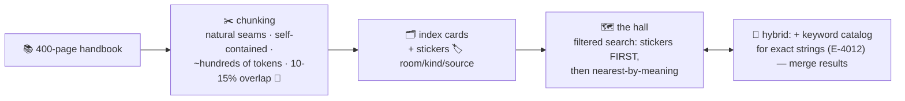

# ✂️ Lesson 06 — Chunking & metadata: cards and colored stickers

**📍 You are here:** Lesson **06** of 8 · Previous: `lesson-05-build-a-vector-db` · Next: `lesson-07-rag-wiring`

---

## 📦 What's in this branch

Lessons 01–05, **plus** the unglamorous decisions that move retrieval
quality more than any index: **how you cut** (chunking) and **how you
label** (metadata) — plus hybrid search.

## 🧒 Explain like I'm 5

You can't seat a 400-page handbook in ONE chair. 📚 Before the hall,
the librarian cuts books into **index cards** ✂️ — and the cutting is
an art:

- **Cards too big** → one card mixes five topics; its seat lands in the
  murky middle of nowhere (an average of meanings is often no meaning).
  Also: fat cards flood the small desk later (AI school L08).
- **Cards too small** → *"…it must be returned."* Returned WHAT? The
  seat is precise but the card is useless without its neighbors.
- **The craft**: cut on natural seams (paragraphs, sections, headings —
  never mid-sentence), keep chunks self-contained-ish, add **overlap**
  🔁 (each card repeats the last lines of the previous one) so ideas
  spanning a boundary live fully on at least one card. Common recipe:
  a few hundred tokens per chunk, 10–15% overlap — then TUNE on your
  data.

And every card gets **colored stickers** 🏷️ (metadata): `room: 3A`,
`kind: rules`, `year: 2026`, `source: handbook-p12`. Stickers make two
superpowers:

1. **Filtered search** — "nearest cards *among kind=rules only*" (our
   `search(query, kind="rules")` — you ran it in the demo!). Meaning
   finds candidates; stickers enforce facts (tenant! permissions! —
   the k8s namespaces instinct).
2. **Receipts** — `source` stickers are what lets RAG cite pages
   (lesson 07).

**Hybrid search** 🤝: meaning-search misses exact strings ("error
E-4012", part numbers, names); keyword search misses synonyms. Grown-up
systems run BOTH and merge (RRF) — the librarian checks the card
catalog AND walks the hall.

## 🗺️ Diagram



## ❓ What

- **Chunking strategies**: fixed-size (simple, seam-blind) ·
  by-structure (headings/paragraphs — usually best) · semantic
  (embed-and-split at topic shifts — fancy, sometimes worth it).
  Always store `source` + position for citations.
- **Overlap** trades storage for boundary-safety. 10–15% is the
  boring, correct default.
- **Metadata filtering at scale** is a real feature, not a for-loop:
  pre-filter shrinks the ANN search space (fast, but the index must
  support it); post-filter can starve your top-k. Lesson 08's products
  differ exactly here.
- **The evals echo** (Agents school L06): retrieval has its own metric
  — "did the right card come back?" Build a tiny golden-questions set
  and re-run it whenever you change chunking. Chunking changes move
  quality 2–5×; index tuning moves it 1.1×. Spend accordingly.

## 🤔 Why

Nine out of ten "RAG gives bad answers" tickets are retrieval tickets,
and most retrieval tickets are chunking tickets: the model answered
correctly from a bad card. You now know where the real dial is — and
that it's held with scissors, not indexes. ✂️

## 🧪 Try it

```bash
python3 - <<'EOF'
import sys; sys.path.insert(0,'vectordb')
from vectordb import MiniVectorDB
db = MiniVectorDB()
# ONE fat card mixing topics vs two clean cards:
db.add("fat",  "Library books are due in two weeks. The picnic needs one pizza per three students.")
db.add("liba", "Library books are due in two weeks.", kind="rules")
db.add("picn", "The picnic needs one pizza per three students.", kind="rules")
for s, i, t, m in db.search("how many pizzas for the picnic?", k=3):
    print(f"{s:.2f}  [{i}] {t}")
EOF
# the clean picnic card outranks the fat mixed one — chunking IS ranking
```

## ⏭️ Next

Wire it all into the pipeline everyone builds: **RAG, end to end** —
with our own database as the page-finder.

```bash
git checkout lesson-07-rag-wiring
```
