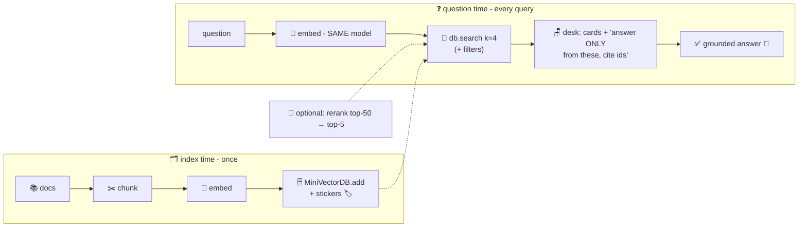

# 📖 Lesson 07 — RAG wiring: the open-book exam, with OUR page-finder

**📍 You are here:** Lesson **07** of 8 · Previous: `lesson-06-chunking-metadata` · Next: `lesson-08-landscape`

---

## 📦 What's in this branch

Lessons 01–06, **plus** the payoff: wiring the vector DB into the RAG
pipeline (AI school L10's open-book exam) — with every stage now a
thing you've built or can read.

## 🧒 Explain like I'm 5

Remember the AI school's open-book exam 📖: put the right pages on the
student's desk and answers become grounded and citable. The missing
machinery was the **page-finder** — and you now own one:

**Index time** (once, and on every doc change):
1. ✂️ cut the handbook into cards (lesson 06),
2. 🔢 seat each card (`embed` — lesson 02; real life: a model),
3. 🗄️ store seat + text + stickers (`db.add` — lesson 05).

**Question time** (every query):
4. 🔢 seat the QUESTION with the *same* embedder (the same-model rule!),
5. 🏃 nearest cards (`db.search`, maybe filtered `room="3A"` —
   lessons 03/04/06),
6. 🪑 paste the top cards onto the model's desk with the instruction
   *"answer ONLY from these, cite the card ids"* (AI L08),
7. ✅ grounded answer, with receipts from the `source` stickers. 🧾

Every arrow in that diagram is now a line of code you've read. The
"magical AI search product" is seven honest steps.

Two grown-up refinements worth knowing by name: **reranking** (retrieve
top-50 cheaply, then a smarter model re-scores to a sharp top-5 — a
second, pickier librarian) and **the long-context question** ("with
1M-token desks, why retrieve at all?" — cost, latency, and
lost-in-the-middle say: retrieval survives; the desk got bigger, not
infinite).

## 🗺️ Diagram



## ❓ What

- **The two clocks**: index time (batch, on change — the ArgoCD
  instinct: re-index tonight, "knows" it tomorrow) vs query time
  (milliseconds, per question). Different scaling, different failures.
- **Failure attribution** (the debugging drill): bad answer? FIRST
  check what cards came back (retrieval bug → lessons 02/06) before
  blaming the model (generation bug → AI L09). Print the cards. Always
  print the cards.
- **k is a dial**: too few cards → missing context; too many → desk
  floods and the middle gets skimmed. 3–8 is the usual band; rerankers
  let you keep k small and sharp.
- **Eval it like an agent** (Agents L06): golden questions → assert
  the right card ids come back (retrieval recall) AND the answer cites
  them. Two numbers, run on every chunking/embedder change.

## 🤔 Why

RAG is the most-built AI system in industry, and this lesson is the
moment it stops being a diagram from a blog: every box is code in THIS
repo. When yours misbehaves at work, you'll debug it by stage —
cards → desk → answer — instead of re-prompting and praying. 🙏

## 🧪 Try it — the whole pipeline in one file

```bash
python3 - <<'EOF'
import sys; sys.path.insert(0,'vectordb')
from vectordb import MiniVectorDB
db = MiniVectorDB()
for i,(t,meta) in enumerate([
  ("Library books must be returned within two weeks.", {"source":"handbook-p4"}),
  ("The picnic requires one pizza per three students, round up.", {"source":"handbook-p9"}),
  ("Class 3A has twelve students.", {"source":"roster-3A"}),
  ("Class 3B has eleven students.", {"source":"roster-3B"})]):
    db.add(f"card-{i}", t, **meta)

q = "how many pizzas do we need for 3A and 3B together?"
cards = db.search(q, k=3)
print("🪑 THE DESK (what you'd paste to the model):\n")
print(f"Answer ONLY from these cards, cite sources:\n")
for s,i,t,m in cards:
    print(f"  [{m['source']}] {t}")
print(f"\nQuestion: {q}")
print("\n→ paste that block into ANY chatbot: grounded answer, real citations 🧾")
EOF
```

## ⏭️ Next

The finale: the actual products — pgvector, Pinecone, Chroma, FAISS &
friends — and how to pick without a bake-off: **the landscape**.

```bash
git checkout lesson-08-landscape
```
